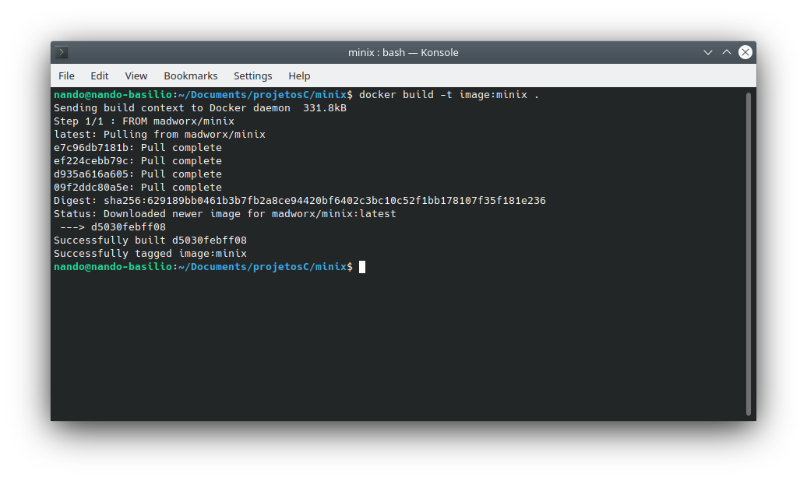
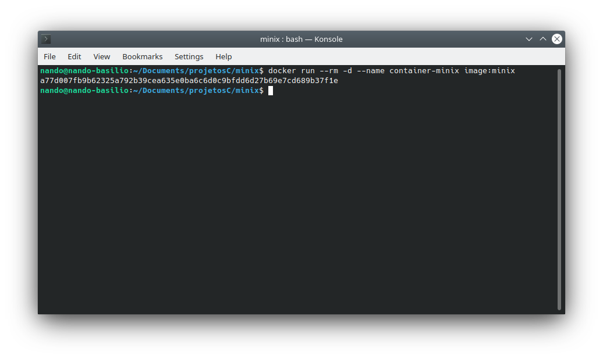
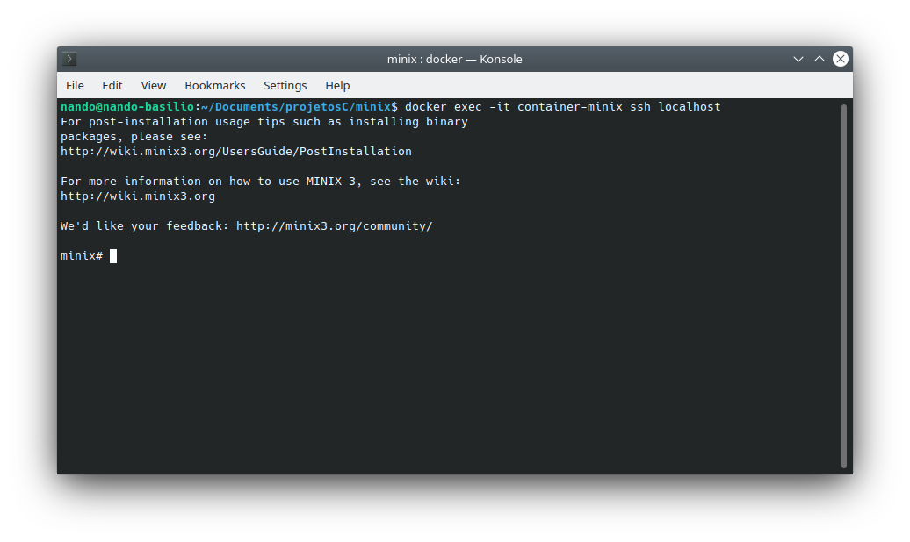

# minix
Run image minix with Dockerfile

## start

Clone project
```sh
git clone http://github.com/nandobas/minix.git
```


go to minix directory 
```sh
cd minix
```

Build image
```sh
docker build -t imagem:minix .
```


Exec container
```sh
docker run --rm -d --name container-minix image:minix
```



And now, login into the minix terminal.\n
Voilà!

```sh
docker exec -it container-minix ssh localhost
```

